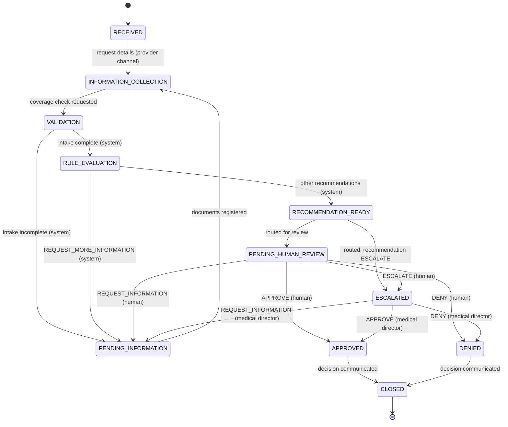

# Architecture

A pre-authorisation line for a (fictional) UAE health insurer. A voice agent takes the call, checks the request
against the benefit catalogue, and prepares a recommendation. People with the right authority make every
authorisation decision.

## One source of truth

`knowledge_base/` is the benefit catalogue: policy tiers, procedure coverage, network providers, members,
onboarding requirements and escalation rules, plus a per-tier schedule of benefits in Markdown.

```
knowledge_base/  ──  preauth.seed  ──▶  catalogue tables  ──▶  rules engine ──▶ recommendation
        │                                                                             │
        └────────────────── uploaded as the agent's knowledge base ───────────────────┘
                     (so every cited section resolves to a retrievable document)
```

The rules decide from the tables loaded out of those files, and the agent retrieves the same files. A coverage
decision citing "Sawt Assurance Comprehensive Schedule of Benefits 2026, Section 4.11" points at a heading that
exists in `knowledge_base/schedule-comprehensive.md`. There is no second coverage dataset.

`scripts/generate_uae_knowledge_base.py` generates and validates the catalogue: per-tier pre-authorisation flags
are computed from each procedure's rule and that tier's threshold, so the data cannot contradict itself.

## Layers

```
   ElevenLabs agent (hosted)      local channel (this process)      provider portal / reviewer tooling
              │                    Whisper · Ollama · Piper                      │
              │                              │                                   │
              └──────────────┬───────────────┘                                   │
                             ▼                                                   ▼
                 agent_tools/  ── 3 typed tools ──┐              api/  ── HTTP, schemas, errors, actors
                                                  ▼                               ▼
                                    application/  desk · evaluation · review · callbacks · audit
                                    │        │          │                 │
                            domain/      rules/    recommendation/   infrastructure/
                      state machine,   ruleset      rule results →     ORM, migration,
                      review policy,   engine       recommendation     repositories,
                      errors, actors  (pure)       (pure)             logging, clock
```

Two voice channels, one system beneath them. `local/` owns speech, the local model and conversation state, and
reaches the rest of the system only through `agent_tools/` and `application/`. `tests/unit/test_architecture.py`
fails if it ever imports `preauth.rules`, `preauth.recommendation` or `domain/case_state.py` — there is one rules
engine and one case lifecycle, and a voice provider does not get its own.

| Layer | Implementation |
|---|---|
| Conversation (hosted) | ElevenLabs agent, configured from `voice/` by `scripts/elevenlabs_setup.py` |
| Conversation (local) | `local/agent.py` over `local/llm.py` (Ollama) and `local/speech.py` (faster-whisper, Piper); see [LOCAL_MODE.md](LOCAL_MODE.md) |
| Agent / orchestration | `agent_tools/toolbox.py` (three tools), `agent_tools/voice_gateway.py` (transport adapter) |
| Case management | `domain/case_state.py`, `application/desk_service.py` |
| Catalogue data | `knowledge_base/` → `seed/catalogue.py` → `infrastructure/db/models.py` |
| Rules / knowledge | `rules/uae_ruleset.py`; `application/rule_context.py` assembles the facts |
| Decision / recommendation | `recommendation/engine.py` |
| Human approval | `application/review_service.py`, `api/routes/review.py` |
| Audit | `AuditRecorder` in `application/unit_of_work.py`; `audit_events` (append-only) |
| Voice channel | `api/routes/voice.py`, `api/routes/local.py`, `application/voice_channel_service.py` |

`tests/unit/test_architecture.py` enforces the dependency direction: `domain`, `rules` and `recommendation` import
nothing from outer layers or frameworks, and routes never touch the database or the rules directly.

## The three tools

| Tool | What it does |
|---|---|
| `verify_caller` | Identifies the organisation and, for member calls, the member. Returns a `verification_id`, the member's tier and dependants, or a failure reason. Lapsed policies fail here. |
| `check_coverage_rule` | Opens a case, evaluates the ruleset, prepares a recommendation, and routes it to a human queue. Requires a `verification_id`. |
| `log_transcript` | Records what the caller was told and returns the reference; raises a callback where a human must follow up. |

**No tool approves, denies or finalises anything.** Recording a decision is a reviewer-only API that the voice
actor has no credentials for.

## Case lifecycle



Every status change goes through `UnitOfWork.transition`, which checks the transition table (including which
actor types may perform it) and writes a `CASE_STATUS_CHANGED` audit event.

## Decision authority: defence in depth

1. **State machine.** Only `HUMAN_REVIEWER` actors may enter `APPROVED` or `DENIED`. The module refuses to load if
   the table is edited to allow otherwise.
2. **Review service.** A decision needs a human reviewer, the role the queue requires (`CLINICAL_REVIEWER`, or
   `MEDICAL_DIRECTOR` for escalations), assignment of the case, a rationale, and a reference to the current
   recommendation.
3. **Agent boundary.** Three tools, none of which decides. Both voice channels authenticate as `VOICE_AGENT`
   (`elevenlabs-agent` and `local-agent`), which the review API rejects. The local model is offered exactly the
   toolbox's tools, so asking it to approve something returns `TOOL_NOT_FOUND`.
4. **Verification before cover.** `check_coverage_rule` requires a `verification_id` from a successful
   `verify_caller`; an unverified or lapsed caller cannot get a coverage answer at all.
5. **Transcript before sign-off.** A case touched by a voice conversation cannot receive any human decision until
   that call's transcript is stored (`CALL_RECORD_PENDING`) — delivered by the ElevenLabs post-call webhook, or
   written by the local process when the call ends. Both produce the same immutable `call_records` row, told apart
   by `platform`.
6. **Database.** A check constraint ties each decision to its resulting status; recommendations and decisions are
   append-only, so a human decision never overwrites a recommendation.
7. **Tests.** `tests/unit/test_state_machine.py`, `tests/integration/test_human_review.py`,
   `tests/integration/test_agent_tools.py`, and the five scripted call simulations.

## Rules

`RuleContext` is an immutable snapshot of every fact the rules may use, stored with each evaluation so results can
be reproduced exactly. Outcomes are `PASS`, `FAIL` or `UNKNOWN`; missing information is always `UNKNOWN`, never
`FAIL`. An `UNKNOWN` that a human must settle carries an `escalation_rule_id`, and the recommendation quotes that
rule's text.

### Ruleset `uae-preauth-ruleset` 2026.09.1

| Rule | Checks | FAIL | UNKNOWN (escalates) |
|---|---|---|---|
| ELIG-001-POLICY-ACTIVE | Policy active on the treatment date | Lapsed, or outside the policy period | — |
| ELIG-002-WAITING-PERIOD | Waiting period served | — | Inside the waiting period (ESC-007) |
| NET-001-PROVIDER-DIRECTORY | Provider active in the directory | — | Suspended or onboarding (ESC-008) |
| NET-002-NETWORK-ACCESS | Provider inside the member's network | Outside it, and the tier excludes out-of-network | — |
| NET-003-PROVIDER-SPECIALTY | Provider credentialed for the specialty | — | Credentialing gap (ESC-008) |
| COV-001-PROCEDURE-IN-SCHEDULE | Procedure listed | — | Not in the schedule (ESC-005) |
| COV-002-TIER-COVERS-PROCEDURE | Tier covers it | Excluded, or benefit starts higher | — |
| COV-003-SCHEDULE-DECIDABLE | Schedule settles it | — | Ambiguous; cites the procedure's own ESC rule |
| DOC-001-REQUIRED-DOCUMENTS | Required documents received | — | Documents outstanding (ESC-001, provider-supplied) |
| LIM-001-TIER-LIMITS | Amount within annual limit and sub-limit | — | Over a limit (ESC-003) |
| AUTH-001-PRE-AUTHORISATION-REQUIRED | Whether pre-authorisation applies at the tier threshold | — | — |

A credentialing or network gap escalates rather than denying: the member may be redirected to a facility that
offers the specialty, and refusing the benefit would be the wrong answer.

**Recommendation precedence:** any `FAIL` → `RECOMMEND_DENIAL`; otherwise an insurer-side `UNKNOWN` → `ESCALATE`;
otherwise a provider-side `UNKNOWN` → `REQUEST_MORE_INFORMATION`; otherwise `RECOMMEND_APPROVAL`.

## Audit trail

`audit_events` is part of the domain. Each event carries its own id, the case id, a contiguous per-case sequence,
type, actor type and id, timestamp, request id and structured data. Events are written in the same transaction as
the change they describe, so a failed operation leaves no partial trail. Database triggers reject `UPDATE` and
`DELETE` on `audit_events`, `rule_evaluations`, `rule_results`, `recommendations`, `review_decisions`,
`voice_tool_invocations`, `call_records`, `caller_verifications` and `call_logs`, on both PostgreSQL and SQLite.

## Observability

Every log line is JSON and carries `request_id`, `case_id`, `conversation_id` and `actor`, captured when the record
is created. Errors use one envelope with a stable machine-readable `code`; unexpected exceptions are logged with a
traceback and returned as `INTERNAL_ERROR` without internal detail. Concurrent writes to a case are detected by
optimistic locking and returned as `CONCURRENT_MODIFICATION`.

## Known limitations and next steps

1. **Authentication.** Identity headers are trusted as supplied and assume a gateway; `PREAUTH_GATEWAY_SECRET`
   protects staff routes, and the voice channel uses one shared bearer token. There is no per-provider data
   scoping: any provider-channel actor can read any case by id.
2. **Broker registry.** The catalogue has no broker directory, so a broker verifies with the provider number of
   the facility the request concerns. A real deployment needs broker records of its own.
3. **Utilisation.** Spend is counted from human-approved cases in the treatment year. Two requests evaluated
   before either is approved can both pass the limit rule.
4. **Documents.** Metadata only; the type is declared by the submitter and content is neither verified nor
   classified.
5. **One procedure per case.** Multi-line requests need a case per line today.
6. **Rules content.** The ruleset is illustrative and operates on synthetic data. Real clinical policy would
   replace it, most likely with a rule-authoring workflow rather than code changes.
7. **Voice channel.** `X-Conversation-ID` is trusted as supplied by the platform. If the post-call webhook is
   misconfigured, reviewers are blocked by design until it is fixed.
8. **ElevenLabs setup.** `scripts/elevenlabs_setup.py` follows the ElevenLabs API reference but has not been run
   against a live account from this repository.
9. **Sensitive data.** Audit data and call transcripts contain clinical free text. Retention, access control and
   encryption policies are still needed.
10. **Local conversation state.** A local call's turn buffer lives in the serving process. Everything that matters
    is already in the database as it happens — the verification, the case, the evaluation, the recommendation, the
    audit trail — but a restart mid-call loses the unsent turns, and the call must be restarted. Local mode is a
    single-process developer and demonstration deployment, not a load-balanced one.
11. **Local model quality.** A 7–8B model on CPU is slower and less reliable at tool calling than a hosted model.
    That is contained rather than hidden: it cannot state a fact the tools did not return, a tool budget forces it
    to answer the caller, and a final-decision sentence is stripped before the caller hears it. What it can still
    do is ask a clumsy question or call a tool with a value the caller did not confirm.
