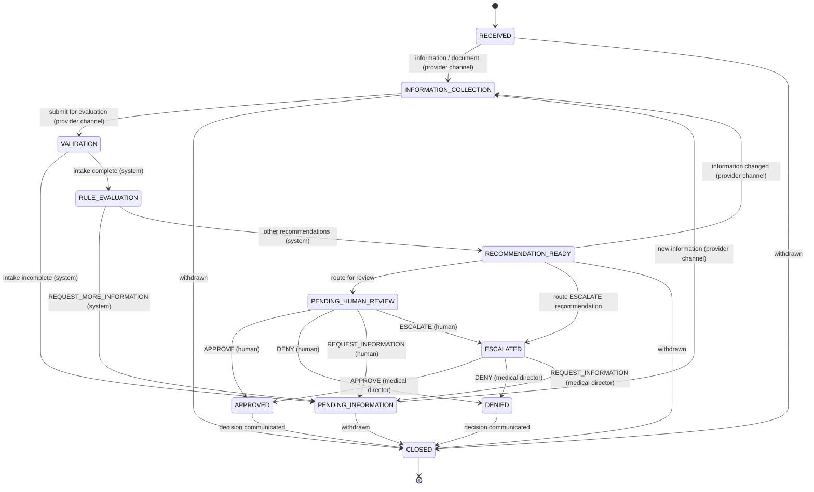

# Architecture

Phase 1 foundation for handling provider pre-authorisation requests. The goal is a backend a future voice agent
can operate on. The agent collects information and routes cases; people with the right authority make every
authorisation decision.

## Layers

```
            future voice runtime (not built)          provider portal / reviewer UI (not built)
                        │                                          │
                agent_tools/  ── typed tools ──┐          api/  ── HTTP, schemas, errors, actor headers
                                               ▼                   ▼
                                   application/  use cases, unit of work, audit recorder, views
                                   │        │          │                 │
                           domain/      rules/    recommendation/   infrastructure/
                     state machine,   ruleset      rule results →     ORM, migrations,
                     review policy,   engine       recommendation     repositories,
                     errors, actors  (pure)       (pure)             logging, clock
```

| Requested layer | Implementation |
|---|---|
| Conversation | ElevenLabs agent (hosted), configured from `voice/` by `scripts/elevenlabs_setup.py`. See [VOICE_AGENT.md](VOICE_AGENT.md). |
| Agent / orchestration | `agent_tools/toolbox.py`: nine typed tools, each calling one application service. `agent_tools/voice_gateway.py`: the ElevenLabs transport adapter. |
| Case management | `domain/case_state.py` (transition table), `application/case_service.py` |
| Provider / patient / request data | `infrastructure/db/models.py` (reference and case tables) |
| Rules / knowledge | `rules/` (engine and mock ruleset); `application/rule_context.py` (knowledge retrieval) |
| Decision / recommendation | `recommendation/engine.py` |
| Human approval | `application/review_service.py`, `api/routes/review.py` |
| Audit | `AuditRecorder` in `application/unit_of_work.py`; `audit_events` table (append-only) |
| External integrations | ElevenLabs server tools and post-call webhook (`api/routes/voice.py`, `application/voice_channel_service.py`). Other reference data is stored in database tables; real integrations would replace `application/rule_context.py` inputs and `ReferenceDataRepository`. |

`tests/unit/test_architecture.py` enforces the dependency rules. `domain`, `rules`, and `recommendation` import
nothing from outer layers or frameworks. Routes never touch the database, rules, or state machine directly.

## Case lifecycle



`RECOMMENDATION_READY` was added to the suggested state list. Without it, a case that has a recommendation but
has not yet been sent for review would have to stay labelled `RULE_EVALUATION`, which would be misleading.
Any change to information in that state sends the case back to `INFORMATION_COLLECTION`. As a result, a
reviewer only ever sees a recommendation computed from the case as it currently stands.

Every status change goes through `UnitOfWork.transition`. That method checks the transition table, including
which **actor types** may perform each transition, and writes a `CASE_STATUS_CHANGED` audit event.

## Decision authority: defence in depth

The requirement that the system never finalises a decision is enforced at six independent levels:

1. **State machine.** Only `HUMAN_REVIEWER` actors may enter `APPROVED` or `DENIED`. The module refuses to load if
   the table is ever edited to allow anything else.
2. **Review service.** A decision requires all of the following:
   - A human reviewer actor.
   - The role the queue requires (`CLINICAL_REVIEWER`, or `MEDICAL_DIRECTOR` for escalations).
   - Assignment of the case to that reviewer.
   - A mandatory rationale.
   - A reference to the *current* recommendation, which guards against decisions based on stale information.
3. **Agent boundary.**
   - The toolbox has no tool that decides, assigns reviewers, closes a decided case, or reads the audit trail, and it
     accepts only `VOICE_AGENT` actors.
   - The recommendation tool returns an explicit notice that the result is not a decision.
   - Cases touched by a voice conversation cannot receive any human decision until the call's post-call transcript
     is stored (`CALL_RECORD_PENDING`).
4. **Views.** Every recommendation is marked `advisory_only: true`.
5. **Database.** A check constraint ties each `review_decisions.decision` to its resulting status. Recommendations
   and decisions are append-only (enforced by triggers), so a human decision can never overwrite a recommendation.
6. **Tests.** `tests/unit/test_state_machine.py`, `tests/integration/test_human_review.py`, and
   `tests/integration/test_agent_tools.py`.

## Rules and recommendations

- **`RuleContext`** is an immutable snapshot of every fact the rules may use. It is stored as `input_snapshot` on
  each `rule_evaluations` row, together with the ruleset name and version, so any evaluation can be re-run and
  reproduced exactly (see `test_evaluation_can_be_reproduced_from_stored_snapshot`).
- **Rule outcomes** are `PASS`, `FAIL`, or `UNKNOWN`:
  - `RuleResult` refuses an `UNKNOWN` that doesn't say what is missing, and a `PASS` or `FAIL` that carries missing
    information.
  - Missing information is always `UNKNOWN`, never `FAIL`.
  - Each missing item has a `source`: `PROVIDER` means ask the caller; `INSURER` means a knowledge gap that the
    caller cannot resolve.
- **Sources.** Every rule result cites what it relied on: the plan document section for coverage rules, or the
  membership and provider register entries for eligibility rules. Recommendations aggregate these citations. The
  voice agent's knowledge base is generated from the same data, so every cited section exists in a retrievable
  document.
- **Evaluation** runs every rule; none short-circuits another. An exception inside a rule aborts the whole
  evaluation, so no recommendation is ever produced from a partial result.
- **Rule versions.** `rule_definitions` records every (rule id, version) pair ever used. Changing a rule's
  description or category without bumping its version is rejected.
- **Recommendation precedence:**
  1. Any `FAIL` → `RECOMMEND_DENIAL`.
  2. Otherwise, an `INSURER` unknown → `ESCALATE`.
  3. Otherwise, a `PROVIDER` unknown → `REQUEST_MORE_INFORMATION`.
  4. Otherwise (all `PASS`) → `RECOMMEND_APPROVAL`.

  An empty result set escalates.

### Mock ruleset (`mock-preauth-ruleset` 2026.09.2)

| Rule | Checks | FAIL when | UNKNOWN when |
|---|---|---|---|
| ELIG-001-POLICY-ACTIVE | Policy status and effective period | Lapsed or cancelled, or the service date is outside the period | — |
| ELIG-002-PROVIDER-CREDENTIALED | Provider credentialing | Suspended or terminated | — |
| ELIG-003-PROVIDER-NETWORK | Network status against the plan | Out of network on a plan without out-of-network cover | — |
| COV-001-PROCEDURE-COVERED | Coverage terms | Procedure excluded | No coverage terms (INSURER) |
| MED-001-DIAGNOSIS-INDICATED | Diagnosis against accepted indications | Diagnosis not indicated | No coverage terms (INSURER) |
| DOC-001-REQUIRED-DOCUMENTS | Registered document types | — (never fails) | Required type missing (PROVIDER) |
| MED-002-CONSERVATIVE-TREATMENT | Weeks of conservative treatment | Below the minimum | Not reported (PROVIDER) |
| LIM-001-ANNUAL-CASE-LIMIT | Human-approved cases in the service year | Limit reached | No coverage terms (INSURER) |

These rules are illustrative. They are **not** real clinical or insurance policy.

## Audit trail

- `audit_events` is part of the domain, not the application logs. Each event records the event ID, case ID, a
  contiguous per-case sequence number, event type, actor type and ID, timestamp, request ID, and structured data.
- Events are written in the same transaction as the change they describe. A failed operation therefore leaves no
  partial trail (`test_failed_operation_leaves_no_partial_audit`).
- Database triggers reject `UPDATE` and `DELETE` on `audit_events`, `rule_evaluations`, `rule_results`,
  `recommendations`, `review_decisions`, `voice_tool_invocations`, and `call_records`. This is verified on both
  SQLite and PostgreSQL.
- Information changes record the previous and new values.
- Internal steps run by the system (validation, evaluation) are attributed to `SYSTEM` and record which actor
  triggered them.

## Observability

- **Logs.** Every log line is JSON and carries `request_id`, `case_id`, and `actor`. These are captured when the
  log record is *created*, so they survive asynchronous handlers.
- **Request IDs.** The request ID comes from `X-Request-ID`, or is generated if absent. It is echoed in responses
  and stored on every audit event.
- **Errors.** Errors use one envelope with a stable machine-readable `code`:
  - Domain errors are logged at WARNING (5xx at ERROR).
  - Unexpected exceptions are logged with a traceback and returned as `INTERNAL_ERROR` without internal details.
- **Concurrency.** Concurrent writes to the same case are detected through optimistic locking (`version`) and
  returned as `CONCURRENT_MODIFICATION`.

## Known limitations and next steps

These gaps are deliberate phase-1 scope limits. They must be resolved before production use.

1. **Authentication and data scoping.** Identity headers are trusted as-is and assume a gateway in front of the
   service. There is also no provider-level data scoping yet: any provider-channel actor can read any case by ID.
2. **Utilisation limits and race conditions.** Two cases for the same member and procedure can each be evaluated
   before either is approved, so both may pass the limit rule. Utilisation is also counted per calendar year, not
   per policy year. A reviewer should see current utilisation at decision time.
3. **Stale reference data.** A recommendation reflects reference data as of its evaluation. If a policy lapses
   after evaluation, the system does not automatically re-evaluate the case before the human decision.
4. **One service per case.** Each case carries exactly one requested service (`requested_services.case_id` is
   unique).
5. **Documents.** Documents are metadata only. The document type is declared by the submitter, and content is
   neither verified nor classified.
6. **Workflow gaps.** There are no service-level-agreement timers for expedited requests, no provider
   notifications, and no supervisor reassignment.
7. **PostgreSQL test coverage.** The automated suite runs on SQLite, built through the real migrations.
   Migrations, triggers, the seed scenarios, and the HTTP review flow have been verified on PostgreSQL by hand.
   CI should run the whole suite against PostgreSQL.
8. **Voice channel.**
   - **Authentication.** The voice channel authenticates with one shared bearer token.
   - **`X-Conversation-ID` trust.** The header is trusted as supplied by the voice platform; anyone holding the token
     could forge it.
   - **Webhook dependency.** If the post-call webhook is misconfigured, reviewers are blocked (by design) until it
     is fixed.
   - **Setup script.** `scripts/elevenlabs_setup.py` follows the ElevenLabs API reference but has not been exercised
     against a live account from this repository.
9. **Sensitive data in the audit trail.** Audit data contains clinical free text. Retention, access control, and
   encryption policies are still needed.
